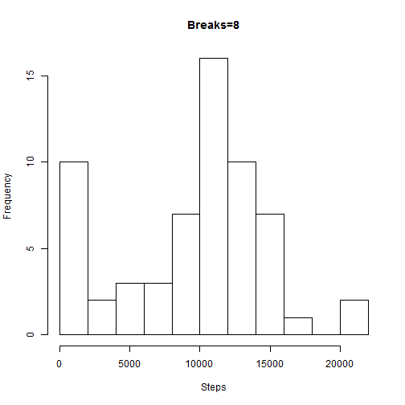
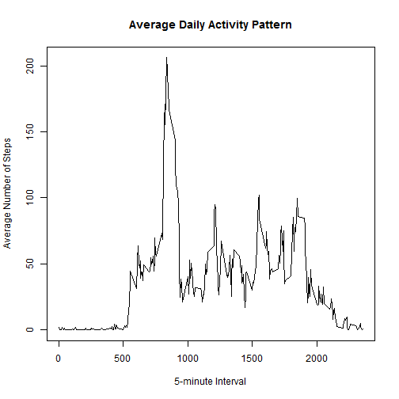
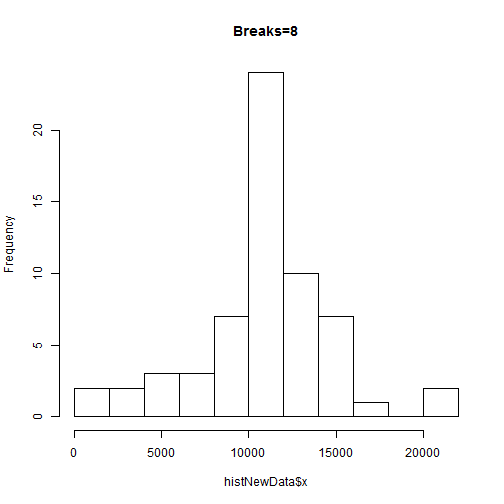
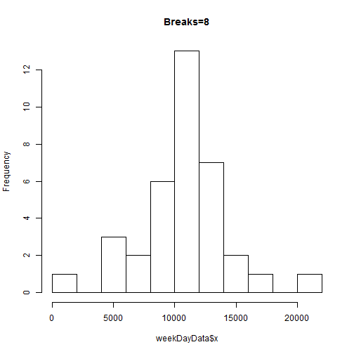
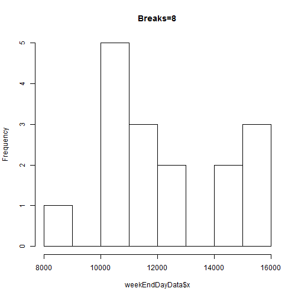
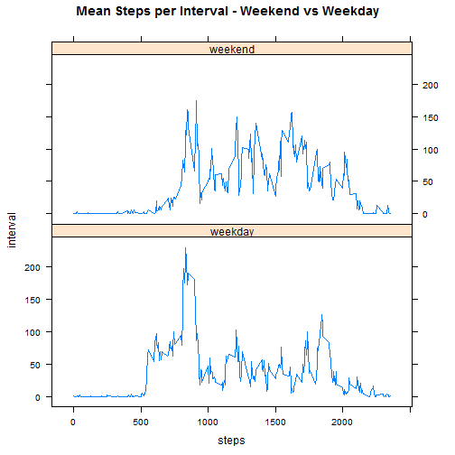

# Student: Thomas Harder
# Course: Reproducible Reseach

## Setting the R working directory
This is likely to have to be modified by the reader to the directory location 
where the reader has stored the data file. 

```r
setwd("C:\\RepData_PeerAssessment1")
```

## Loading Libraries
At this time no special libraries are required. This may change and this section
would then become necessary. 

```r
# library(ggplot2)
library(lattice)
```
## Loading and preprocessing the data
### Loading the raw data
Load the data (i.e. read.csv()). Here the raw data file is read into the R IDE
in preparation of preprocessing and processing. The file location may need to be 
changed by the reader to reflect where they have stored the data and where they 
have set the working directory to. 

```r
file <- "./activity/activity.csv"
data <- read.csv(file, header = TRUE, sep = ",",stringsAsFactors=FALSE)
```

### Preprocessing the raw data
In this section the data is being aggregated by date and then it is summed to 
get the total number of steps per day. 

```r
histdata <- aggregate(data$steps, by=list(dates=data$date), FUN=sum, na.rm=TRUE)
histdata$dates = as.Date(histdata$dates, format="%Y-%m-%d")
```
## Plotting a historgram of the total number of steps take each day.  
Make a histogram of the total number of steps taken each day Histogram of 
steps in bins and number of days for each bin. na values were removed in the
previous step because they interfer with the calculation of the mean. They also 
affect the skewness of the histgram. 

```r
sum(is.na(histdata$x))
```

```
## [1] 0
```

```r
hist(histdata$x, breaks=8, main="Breaks=8", xlab="Steps")
```

 
Here we can see that the histogram is roughly a normal distribution. The form of
the distribution changes with the number of breaks (bins). But all remain fairly 
normal with the exception of the first bin. 

## What is mean total number of steps taken per day?
### Calculating the mean and median values. 
Calculate and report the mean and median total number of steps taken per day

```r
meanSteps <- mean(histdata$x, na.rm = TRUE)
meanSteps
```

```
## [1] 9354.23
```

```r
medianSteps <- median(histdata$x, na.rm=TRUE)
medianSteps
```

```
## [1] 10395
```
## What is the average daily activity pattern?
### Plotting the Average Daily Activity
Make a time series plot (i.e. type = "l") of the 5-minute interval (x-axis) 
and the average number of steps taken, averaged across all days (y-axis)

Building a new data set where the each row consists of two fields. 
The 5-minute interval and the mean number of steps of all of the 5-minute
intervals. 

```r
iD2 <- aggregate(steps ~ interval, data, mean)

plot(iD2$interval, iD2$steps, type="l",
     main="Average Daily Activity Pattern",
     xlab="5-minute Interval", 
     ylab="Average Number of Steps",
)
```

 

## Determining which 5-minute interval has the Maximum Number of Steps. 
Which 5-minute interval, on average across all the days in the dataset, 
contains the maximum number of steps?
In this code section the max() function is used to determine which interval contains the maximum number of steps. 

```r
iD2[iD2$steps == max(iD2$steps),]
```

```
##     interval    steps
## 104      835 206.1698
```

## Imputing missing values
Note that there are a number of days/intervals where there are missing values (coded 
as NA). The presence of missing days #may introduce bias into some calculations or 
summaries of the data.

Calculate and report the total number of missing values in the dataset (i.e. the 
total number of rows with NAs)

```r
sum(is.na(data$steps))
```

```
## [1] 2304
```

Devise a strategy for filling in all of the missing values in the dataset. The strategy does not need to be sophisticated. #For example, you could use the mean/median for that day, or the mean for that 5-minute interval, etc.
The stategy that I have choose to use is to replace the na's with their respective 5-minute interval means. 

Create a new dataset that is equal to the original dataset but with the missing data filled in.


```r
newdata <- data
for (i in 1:nrow(newdata)){
    if (is.na(newdata$steps[i])){
        newdata$steps[i] <- iD2$steps[which(newdata$interval[i] == iD2$interval)]
    }
}
```

Verifies that their is no longer any na's in the newdata data set. 

```r
sum(is.na(newdata$steps))
```

```
## [1] 0
```

## Total Number of Steps taken each day without na's.
4. Make a histogram of the total number of steps taken each day and Calculate and report the mean and median total number of #steps taken per day. 


```r
# histogram of the total number of steps taken each day
histNewData <- aggregate(newdata$steps, by=list(dates=newdata$date), FUN=sum)
histNewData$dates = as.Date(histdata$dates, format="%Y-%m-%d")
hist(histNewData$x, breaks=8, main="Breaks=8")
```

 

```r
# mean and median total number of #steps taken per day
mOfx <- mean(histNewData$x, na.rm=TRUE)
mOfx <- median(histNewData$x, na.rm=TRUE) 
```
Do these values differ from the estimates from the first part of the assignment?
Yes 
 
What is the impact of #imputing missing data on the estimates of the total daily 
number of steps?

The mean does differ from the previous estimates, by about 1000 steps, 
the median median differs by only 1 step. So there is an impact in leaving in 
the na's versus removing them. 

## Determining differences in activity patterns between weekday and weekends
Are there differences in activity patterns between weekdays and weekends?
For this part the weekdays() function may be of some help here. Use the dataset 
with the filled-in missing values for this #part.


Create a new factor variable in the dataset with two levels - "weekday" and
"weekend" indicating whether a given date is a #weekday or weekend day.

```r
# mutating dates to weekdays, using the weekdays function
histNewData$weekday <- weekdays(histNewData$dates)

# create our weekday subset of data. 
weekDayData <- histNewData[histNewData$weekday %in% c("Monday", "Tuesday", "Wednesday", "Thrusday", "Friday"), ]
hist(weekDayData$x, breaks=8, main="Breaks=8")
```

 

```r
# create the weekend data
weirddata <- newd2 [newd2$date %in% c("Monday", "Tuesday", "Wednesday", "Thrusday", "Friday", "Saturday", "Sunday"), ]
```

```
## Error in eval(expr, envir, enclos): object 'newd2' not found
```

```r
weekEndDayData <- histNewData[histNewData$weekday %in% c("Sunday", "Saturday"), ]
hist(weekEndDayData$x, breaks=8, main="Breaks=8")
```

 

## Plot weekday vs weekend daily activity. 
Make a panel plot containing a time series plot (i.e. type = "l") of the 5-minute interval (x-axis) and the average number #of steps taken, averaged across all weekday days or weekend days (y-axis). The plot should look something like the #following, which was creating using simulated data:

```r
newd2 <- data
newd2$date = as.Date(newd2$date, format="%Y-%m-%d")
newd2$date <-  weekdays(newd2$date)

wddata2 <- newd2[newd2$date %in% c("Monday", "Tuesday", "Wednesday", "Thrusday", "Friday"), ]
wddata2 <- aggregate(steps ~ interval, wddata2, mean)

weddata2 <- newd2[newd2$date %in% c("Sunday", "Saturday"), ]
weddata2 <- aggregate(steps ~ interval, weddata2, mean)

wddata2$group <- "weekday"
weddata2$group <- "weekend"

intdata <- rbind(wddata2, weddata2)

xyplot(intdata$steps ~ intdata$interval | intdata$group, layout = c(1,2), type="l", 
       main="Mean Steps per Interval - Weekend vs Weekday", xlab = "steps", ylab = "interval")
```

 
